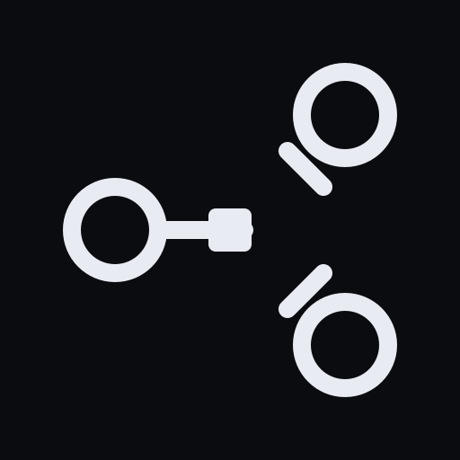
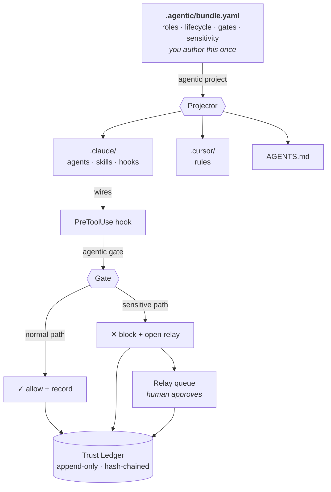
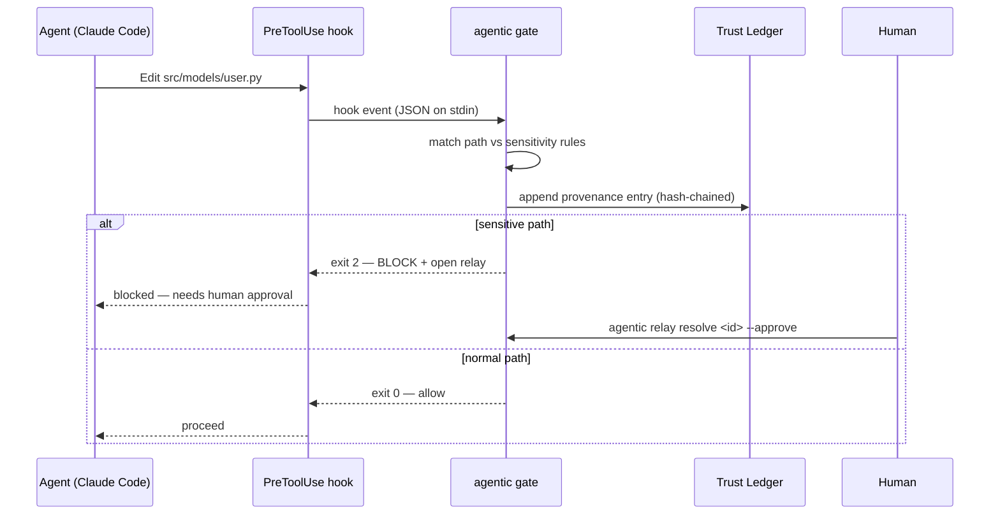
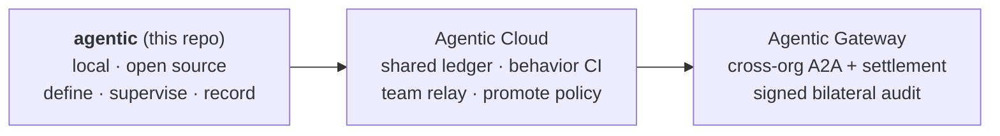

<p align="center">
  
</p>

<h1 align="center">Agentic CLI</h1>

<p align="center">
  <strong>A supervisory framework for agentic development.</strong><br/>
  Define your agent fleet, lifecycle, and gates once — compile them into any harness,
  supervise every run, and record it all as tamper-evident provenance.
</p>

<p align="center">
  <a href="https://github.com/Agentic-CLI/agentic-cli/actions/workflows/ci.yml"></a>
  
  
  
</p>

---

## Why

As agents write more of the code, **the code stops being the trust artifact — the trace of how it was produced becomes the artifact.** You can't establish trust by reading a diff a machine wrote at scale. Trust has to move to *provenance*: which agents, through which gates, with which human approvals, verified how.

Every agent framework today is **containment** — LangGraph, CrewAI, AutoGen: *your agents run inside our runtime*. That's invasive; you rewrite your work to live in the box.

**Agentic CLI is the inversion.** Your agents keep running inside Claude Code or Cursor. Agentic CLI *describes and supervises* them from the outside, and records what they did — without asking you to rewrite anything.

> A framework by **declaration + supervision**, not by containment. Remove it and your generated config still works — you just lose the gates and the ledger.

## The loop

```
Define  →  Compile  →  Supervise  →  Record
bundle     projector   hooks/gates   trust ledger
```



## Quickstart

**Zero dependencies.** Runs on stock Python 3.9+ (uses PyYAML if present, otherwise a built-in YAML fallback).

```bash
# Install (pipx keeps it isolated and on your PATH — recommended for CLIs)
pipx install git+https://github.com/Agentic-CLI/agentic-cli.git

# ── in any repo ──
agentic init            # 1. Define — scaffold .agentic/bundle.yaml
agentic project         # 2. Compile — generate .claude/, .cursor/, AGENTS.md + hooks
agentic ledger          # 4. Record — read the provenance trail (empty until agents run)
```

Don't want to install anything? Clone and run the launcher directly:

```bash
git clone https://github.com/Agentic-CLI/agentic-cli.git
./agentic-cli/agentic --help
```

## See a gate fire

Once `agentic project` has wired the Claude Code hook, every edit an agent makes is checked. Here's the exact event flow — normal edits pass; edits to paths your bundle marks *sensitive* are blocked and routed to a human:



You can reproduce it without a live agent by feeding the gate the same JSON Claude Code sends:

```bash
cd examples/todo-app && agentic project

# normal file → allowed (exit 0)
echo '{"session_id":"s1","cwd":"'$PWD'","tool_name":"Edit","tool_input":{"file_path":"src/todo/api.py"}}' | agentic gate

# sensitive file → BLOCKED + relay opened (exit 2)
echo '{"session_id":"s1","cwd":"'$PWD'","tool_name":"Write","tool_input":{"file_path":"src/todo/models/todo.py"}}' | agentic gate

agentic ledger          # both events, hash-chained
agentic relay list      # the blocked one, awaiting a human
```

## Non-invasive by design

Non-invasiveness isn't a feature bolted on — it's the constraint the whole tool is built around:

| Tenet | How |
|---|---|
| **Additive, not intrusive** | One directory (`.agentic/`). Harness configs are *generated* and marked; commit or gitignore them at will. |
| **Observe before enforce** | `agentic observe` reconstructs provenance from what already exists (git history today; PR/CI/session-log adapters next). |
| **Out of the hot path** | Control runs at the harness's own hook boundary — never by wrapping the agent. If Agentic is gone, work proceeds. |
| **Enforce only at declared gates** | Only paths your bundle marks *sensitive* can block. Everything else is recorded and proceeds. |
| **Local-first & git-native** | The ledger is append-only files under `.agentic/`. No cloud required to get value. |

## Commands

| Command | Step | What it does |
|---|---|---|
| `agentic init` | Define | Scaffold `.agentic/bundle.yaml` (roles, lifecycle, gates, sensitivity) |
| `agentic project` | Compile | Generate `.claude/`, `.cursor/`, `AGENTS.md` from the bundle |
| `agentic gate` | Supervise | PreToolUse hook handler — records to the ledger; blocks sensitive paths + opens a relay |
| `agentic ledger` · `trace <run_id>` | Record | Read the append-only, hash-chained provenance ledger |
| `agentic relay list` · `resolve` | Govern | Human-in-the-loop queue for blocked sensitive changes |
| `agentic observe` | Observe | Reconstruct provenance from git history (zero behavior change) |
| `agentic doctor` | — | Validate the bundle, detect config drift, verify ledger integrity |

## The bundle

One vendor-neutral file is the source of truth. `agentic project` compiles it into every harness you target:

```yaml
schema_version: "1"
name: my-app
sdlc:
  roles:
    - id: feature-engineer
      role: "Build the feature end to end; write tests; keep changes small and reversible."
      owns: ["src/**"]
      capabilities: [read, edit, write, bash]
      pairs_with: [reviewer]
    - id: reviewer
      role: "Independently review for correctness first. Never edits code."
      capabilities: [read, grep, bash]
  lifecycle:
    phases: [discover, plan, implement, qa, review, ship]
    gates:
      definition_of_ready: { after: plan, requires: [plan_note] }
      definition_of_done:  { after: ship, requires: [test_evidence, review_pass] }
  sensitivity:
    rules:
      - match: { paths: ["**/models/**", "**/*schema*", "**/auth/**", "**/*migration*"] }
        level: sensitive
        require: [adversarial_review, human_relay]
projections: [claude-code, cursor, agents-md]
```

Change roles, gates, or sensitivity here → run `agentic project` → every harness updates. No more re-authoring the same rules three times across `.claude`, `.cursor`, and `AGENTS.md`.

## Where it fits

Agentic CLI is the local, open-source spine of a larger picture — the same trust loop, from your laptop to cross-org agent commerce:



Learn more at **[agentic-cli.com](https://agentic-cli.com)**.

## Roadmap

**Working today:** `init` · `project` (Claude Code + Cursor + AGENTS.md) · `gate` · `ledger`/`trace` · `relay` · `observe` (git) · `doctor` · hash-chained integrity.

**Next:** ed25519 signing (replacing the hash-chain stand-in) · PR/CI/session-log observe adapters · `agentic add pattern` (installable policy packs) · the dev-time ↔ runtime `run_id` join.

## Contributing

Contributions welcome — see [CONTRIBUTING.md](CONTRIBUTING.md). Run the tests with:

```bash
python -m venv .venv && .venv/bin/pip install -e ".[dev]"
.venv/bin/python -m pytest
```

## License

[Apache-2.0](LICENSE). Open source on purpose: the CLI is free and yours to run anywhere — the commercial layer is the shared Cloud, not this code.
