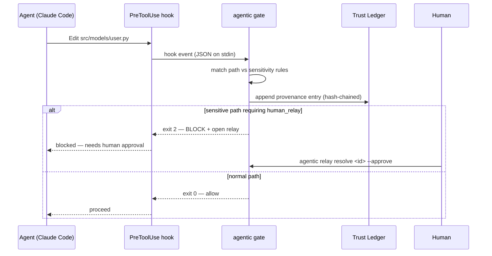
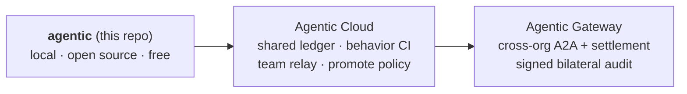

<p align="center">
  
</p>

<h1 align="center">Agentic CLI</h1>

<p align="center">
  <strong>Governance for AI coding agents.</strong><br/>
  You don't contain them — you <strong>supervise</strong> them, and the trace becomes the trust artifact.
</p>

<p align="center">
  <em>An agent rewrote your auth layer at 2&nbsp;a.m. Who approved it? Which rules did it pass?<br/>
  Today the honest answer is "read the diff and hope." Agentic CLI makes it an auditable fact.</em>
</p>

<p align="center">
  <a href="https://github.com/Agentic-CLI/agentic-cli/actions/workflows/ci.yml"></a>
  
  
  
</p>

<p align="center">⭐ Star to follow — built in the open.</p>

---

## What it is

Every agent framework today is **containment** — LangGraph, CrewAI, AutoGen: *your agents run inside our runtime*. That's invasive; you rewrite your work to live in the box.

**Agentic CLI is the inversion.** Your agents keep running inside Claude Code or Cursor. Agentic CLI *describes and supervises* them from the outside, and records what they did — without asking you to rewrite anything.

> A framework by **declaration + supervision**, not containment. Remove it and your generated config still works — you just lose the gates and the ledger.

**Concepts, one line each:**
- **Bundle** — one file (`.agentic/bundle.yaml`) declaring your agent roles, lifecycle, gates, and which paths are sensitive.
- **Projector** — compiles that bundle into harness-native config (`.claude/`, `.cursor/`, `AGENTS.md`).
- **Gate** — a hook that checks each agent action; sensitive ones can pause for a human.
- **Relay** — the human-approval queue a gate opens when it blocks.
- **Ledger** — an append-only, hash-chained record of what happened, keyed by run.

The loop: **Define → Compile → Supervise → Record.**

## Install

**Zero dependencies.** Runs on stock Python 3.9+ (uses PyYAML if present, else a built-in fallback).

```bash
curl -fsSL https://raw.githubusercontent.com/Agentic-CLI/agentic-cli/main/install.sh | bash
```

The installer auto-detects `uv → pipx → venv`. Prefer to pick? (or [read the script](install.sh) first):

```bash
uv tool install git+https://github.com/Agentic-CLI/agentic-cli.git    # modern, fast
pipx install    git+https://github.com/Agentic-CLI/agentic-cli.git    # classic, isolated
git clone https://github.com/Agentic-CLI/agentic-cli.git && ./agentic-cli/agentic --help   # no install
```

## Quickstart — watch a gate fire

The fastest "aha": set up governance, then make an agent's edit hit it. Using the bundled example:

```bash
cd examples/todo-app
agentic init        # 1. Define — scaffold .agentic/bundle.yaml
agentic project     # 2. Compile — generate .claude/, .cursor/, AGENTS.md + hooks
                    # 3. Supervise happens automatically via the Claude Code hook

# Simulate the exact event Claude Code sends the hook on each edit:
echo '{"session_id":"s1","cwd":"'$PWD'","tool_name":"Edit","tool_input":{"file_path":"src/todo/api.py"}}' | agentic gate
#   → exit 0: allowed (a normal file)

echo '{"session_id":"s1","cwd":"'$PWD'","tool_name":"Write","tool_input":{"file_path":"src/todo/models/todo.py"}}' | agentic gate
#   → exit 2: BLOCKED — a sensitive path; a relay is opened for a human

agentic ledger        # 4. Record — both actions, hash-chained
agentic relay list    # the blocked one, awaiting approval
agentic relay resolve <id> --approve --approver you@co
```

That's the whole loop, visible in 60 seconds — no live agent required (the JSON is exactly what Claude Code's `PreToolUse` hook delivers).

## How it works


The gate, in sequence — normal edits pass; edits to paths your bundle marks **sensitive with `human_relay`** are blocked and routed to a human:



> **Harness support today:** the projector compiles to **Claude Code, Cursor, and AGENTS.md**. Runtime supervision (gate + relay + ledger) runs via **Claude Code's hooks** today; more harnesses as they expose hook points.

## Non-invasive by design

| Tenet | How |
|---|---|
| **Additive, not intrusive** | One directory (`.agentic/`). Harness configs are *generated* and marked; commit or gitignore them at will. |
| **Observe before enforce** | `agentic observe` reconstructs provenance from what already exists (git history today; PR/CI/session-log adapters next). |
| **Out of the hot path** | Control runs at the harness's own hook boundary — never by wrapping the agent. If Agentic is gone, work proceeds. |
| **Enforce only at declared gates** | Only paths your bundle marks *sensitive with `human_relay`* can block. Everything else is recorded and proceeds. |
| **Local-first & git-native** | The ledger is append-only files under `.agentic/`. No cloud required to get value. |

## Commands

| Command | Step | What it does |
|---|---|---|
| `agentic init` | Define | Scaffold `.agentic/bundle.yaml` |
| `agentic project` | Compile | Generate `.claude/`, `.cursor/`, `AGENTS.md` from the bundle |
| `agentic gate` | Supervise | PreToolUse hook — records to the ledger; blocks sensitive+`human_relay` paths, opens a relay |
| `agentic ledger` · `trace <run_id>` | Record | Read the append-only, hash-chained ledger (a *run* groups one agent session's actions) |
| `agentic relay list` · `resolve` | Govern | Human-in-the-loop queue for blocked changes |
| `agentic add` · `lock` | Packs | Reuse personas/standards from a git repo, sha-pinned ([docs/PACKS.md](docs/PACKS.md)) |
| `agentic observe` | Observe | Reconstruct provenance from git history |
| `agentic doctor` · `--version` | — | Validate bundle, detect drift, verify ledger integrity · print version |

## The bundle — author once, compile everywhere

The whole point: write your fleet, lifecycle, and gates **once**, and never re-author them per harness.

```yaml
schema_version: "1"
name: my-app
sdlc:
  roles:
    - id: feature-engineer
      role: "Build the feature end to end; write tests; keep changes small and reversible."
      owns: ["src/**"]
      capabilities: [read, edit, write, bash]
      pairs_with: [reviewer]
    - id: reviewer
      role: "Independently review for correctness first. Never edits code."
      capabilities: [read, grep, bash]
  lifecycle:
    phases: [discover, plan, implement, qa, review, ship]
    gates:
      definition_of_ready: { after: plan, requires: [plan_note] }
      definition_of_done:  { after: ship, requires: [test_evidence, review_pass] }
  sensitivity:
    rules:
      - match: { paths: ["**/models/**", "**/*schema*", "**/auth/**", "**/*migration*"] }
        level: sensitive
        require: [adversarial_review, human_relay]
projections: [claude-code, cursor, agents-md]
```

## Reusable packs

Keep well-written personas and standards in one git repo and pin them from every project — versioned by ref, sha-locked, with per-repo overrides:

```yaml
# .agentic/bundle.yaml
extends:
  - git::https://github.com/acme/agentic//personas/security-reviewer.yaml@v1.2.0
sdlc:
  roles:
    - use: security-reviewer        # inherit the canonical persona…
      owns: ["src/payment/**"]      # …with THIS repo's paths
      overrides: { refuses: ["floats for money"] }   # …and local additions
```

```bash
agentic add git::https://github.com/acme/agentic//personas/security-reviewer.yaml@v1.2.0
agentic project
```

Resolution is pinned to an exact commit in `.agentic/agentic.lock` (reproducible; tags move, shas don't). Full spec: **[docs/PACKS.md](docs/PACKS.md)**.

## Roadmap

**Working today:** `init` · `project` (Claude Code + Cursor + AGENTS.md) · `gate` · `ledger`/`trace` · `relay` · `observe` (git) · `doctor` · reusable packs (`add`/`lock`) · hash-chained ledger integrity.

**Next:** ed25519-signed provenance (replacing the hash-chain stand-in — today's ledger detects accidental edits/corruption, not a determined tamperer without an external anchor) · PR/CI/session-log observe adapters · standards & lifecycle packs + a hosted registry · the dev-time ↔ runtime `run_id` join.

## Where it fits

Agentic CLI is the local, **free-forever, fully-local** spine of a larger picture — the same trust loop, from your laptop to cross-org agent commerce. The commercial layer is the shared Cloud, **never this code**.



The vision, the Cloud waitlist, and the packs registry: **[agentic-cli.com](https://agentic-cli.com)**.

## Contributing

Contributions welcome — see [CONTRIBUTING.md](CONTRIBUTING.md).

```bash
python -m venv .venv && .venv/bin/pip install -e ".[dev]"
.venv/bin/python -m pytest        # 75 tests, standard-library only
```

## License

[Apache-2.0](LICENSE). Open source on purpose: the CLI is free and yours to run anywhere — the commercial layer is the shared Cloud, not this code.
